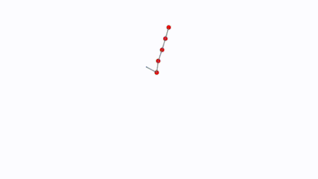

# micos - Minimal Constraint Solver

micos (Minimalistic Constraint Solver) is a lightweight, constraint-based physics solver designed for 2D simulations. 

[Test Systems](https://jaimelopezgarcia.github.io/micos.js/dist/index.html#)

